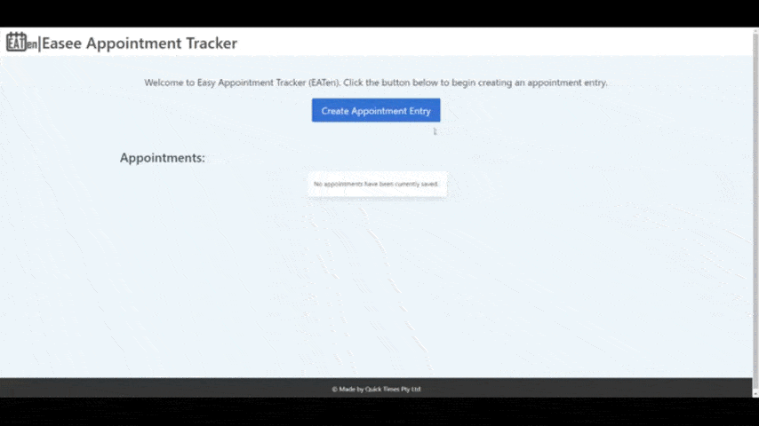
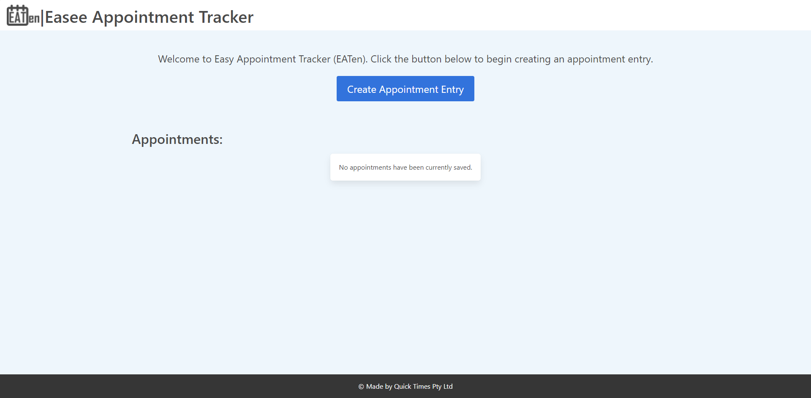
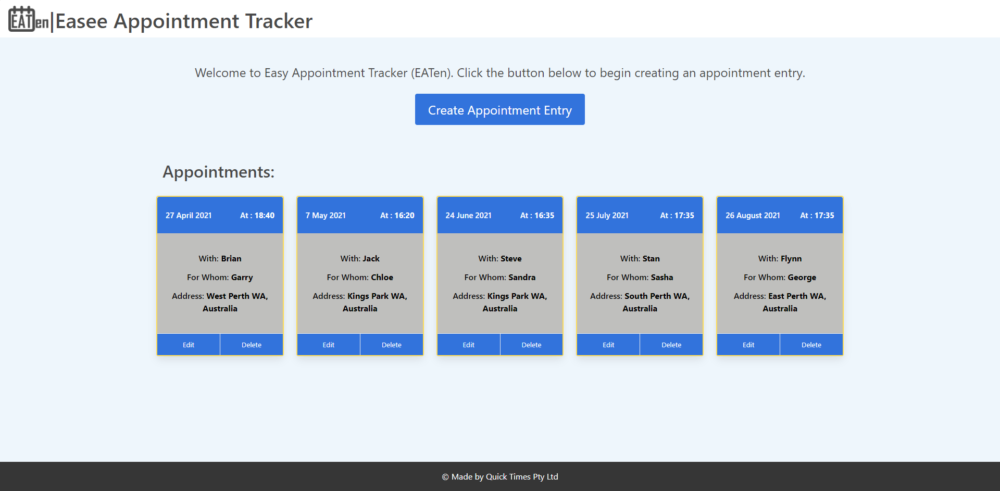

# Easy Appointment Tracker

## Description
An easy to use appointment tracking system for people looking for a quick way to record and track appointments for themselves and/or for others they are caring for.

## Link

The link to the deployed application: https://trushilbudhia.github.io/Easy-Appointment-Tracker/

## Screenshots

The following image show the web application's appearance:

## Technologies:
- [Bulma CSS Framework](https://bulma.io/)
- [Font Awesome (icons)](https://fontawesome.com/)
- [Google Places API](https://developers.google.com/maps/documentation/places/web-service/overview)
- [Google Maps JavasScript API](https://developers.google.com/maps/documentation/javascript/overview)

## Planning:
- Press Release: https://docs.google.com/document/d/16Bww3PsYusVdDvxp1XdB9QIqc9ds5kUuWlFNIDZ8BDM/edit?usp=sharing
- User Story Map: https://miro.com/app/board/o9J_lK4FG6Y=/
- Presentation: https://docs.google.com/presentation/d/1mwk3Qxx22pZZJDR3GQr3JfHNCrO44kKw-MfEVnHWGH8/edit?usp=sharing

## Contributing
Contributions, issues and feature requests are welcome.

## License
This project is [MIT](./LICENSE) licensed

## Collaborators
- [Shane Curtis](https://github.com/ShaneCurtis84)
- [Susanne Bilney](https://github.com/Susanne85)
- [Trushil Budhia](https://github.com/TrushilBudhia)